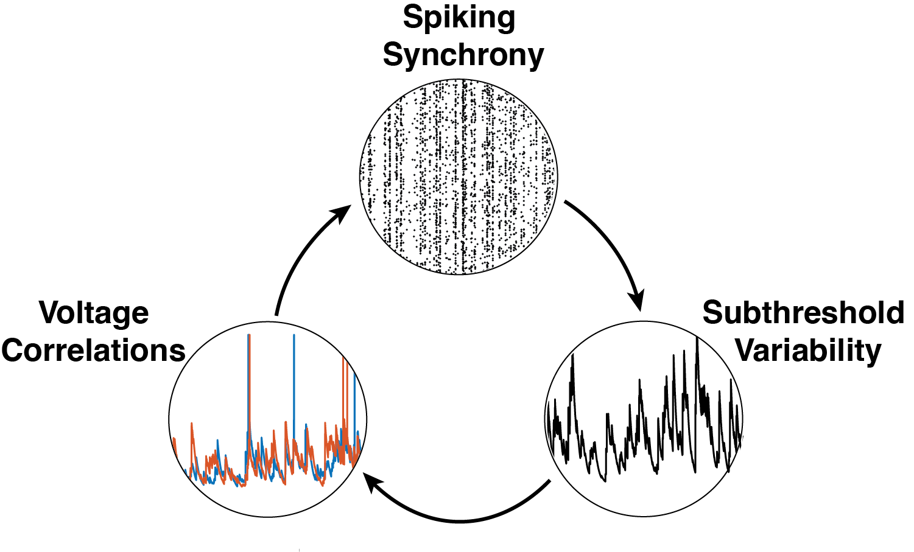
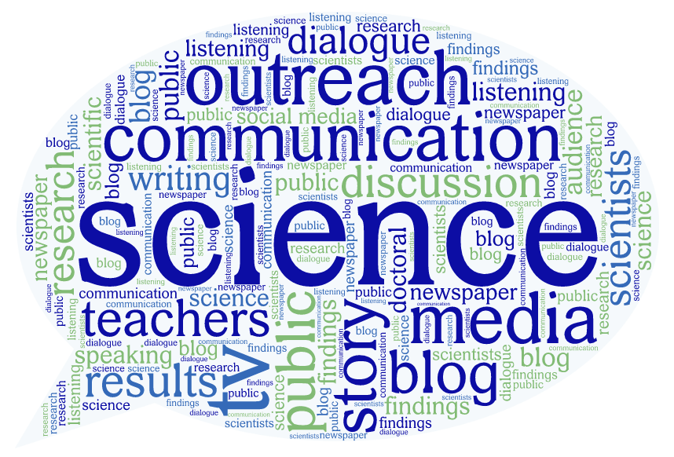

<!-- My Intro Card -->

  

    

      
    

    

      

        <h2 class="card-title">About Me</h2>
        
I am a neuroscientist with a strong foundation in physics and a passion for
              understanding the brain through computational and mathematical modeling. I earned my BS in Physics and
              Astronomy in 2017 and an MS in Neurobiology in 2019 from Stony Brook University, where I developed a
              biophysically inspired neuronal model to predict spike timing patterns with large inter-spike intervals.

              From 2019-2020 I worked as a Technical Associate at MIT, where I investigated the pharmacological effects
              of non-benzodiazepine compounds on brain rhythms in rodent models. Currently, I am pursuing a PhD in
              Neuroscience at UT Austin, where I use advanced computational tools to study how input synchrony shapes
              neural variability.

              Beyond research, I am deeply committed to science outreach. I served as the Science Outreach Coordinator
              for the UT Austin N	euroscience Graduate Program for two years, organizing events to make neuroscience
              accessible and engaging to the broader community.       

      

    

  

<!-- Research Card -->

  

    

      

        <h2 class="card-title">Research Interest</h2>
        
I am broadly interested in how complex patterns of neural activity emerge from
              relatively simple rules governing synaptic input and network dynamics. My PhD research focuses on
              understanding how input synchrony influences subthreshold variability and other higher-order statistical
              moments of neural activity. Using a combination of mathematical modeling and computational analysis, I
              investigate how different patterns of synaptic input drive changes in both spiking and subthreshold
              activity, with an emphasis on the mechanisms that shape their variability and reliability. This work
              addresses a fundamental question in neuroscience: how the structure of inputs gives rise to the rich
              diversity of neural dynamics observed in the brain. My approach integrates tools from computational
              neuroscience, statistical analysis, and machine learning.        

      

    

    

      
    

  

<!-- Outreach Card -->

  

    

      
    

    

      

        <h2 class="card-title">Outreach</h2>
        
Driven by the widespread mis- and disinformation surrounding science, I became deeply
              committed to public engagement and science communication. From 2022 to 2024, I served as the Science
              Outreach Coordinator for the UT Austin Neuroscience Graduate Program. In this role, I organized and led
              outreach events aimed at fostering curiosity and a deeper understanding of neuroscience and the scientific
              process among elementary and middle school students, as well as the broader community. Through interactive
              visual demonstrations and engaging presentations, I helped make complex neuroscience concepts accessible
              and exciting, with the goal of inspiring the next generation of scientists and promoting public trust in
              science.        

      

    

  

